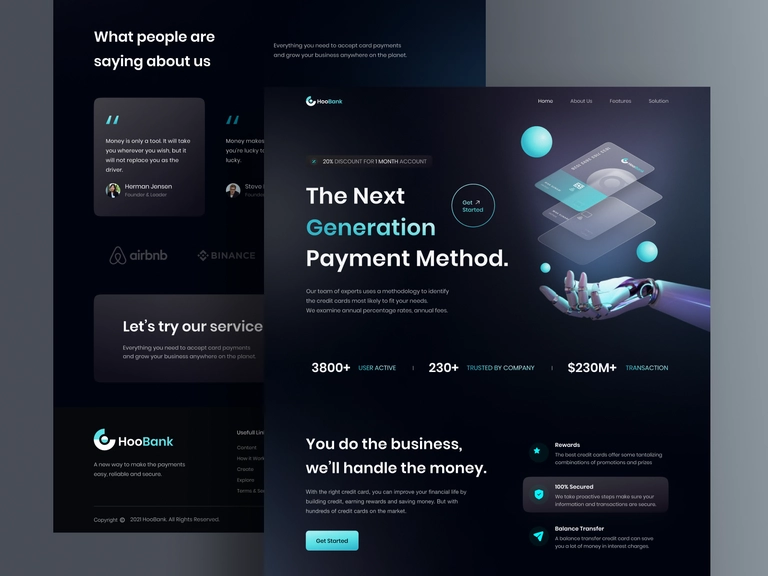

# HooBank - Digital Payment LandingPage

Bienvenido a la página de destino de HooBank, donde encontrará un diseño de interfaz de usuario moderno y atractivo. 



# Sobre este proyecto

HooBank es un proyecto personal creado para mostrar mis habilidades en el desarrollo de una página de destino con un diseño moderno y atractivo. El objetivo de este proyecto es demostrar mi experiencia en el diseño de interfaz de usuario y en el uso de técnicas de diseño responsive para garantizar una experiencia óptima en todos los dispositivos.

La página de destino de HooBank es una simulación de una plataforma bancaria en línea, que ofrece una variedad de servicios bancarios, desde la gestión de cuentas hasta la realización de transacciones. El diseño es limpio y organizado, con una interfaz fácil de navegar y una presentación clara y atractiva de todas las características y servicios.

Este proyecto me permitió desarrollar mis habilidades en el diseño web y el desarrollo front-end, y estoy orgulloso de lo que he logrado. Si estás buscando un desarrollador web con habilidades en diseño UI y responsive design, no dudes en ponerte en contacto conmigo para discutir cómo puedo ayudarte a alcanzar tus objetivos."

## Lenguajes y herramientas
* HTML y CSS3
* ReactJS
* Typescript
* TailwindCSS
* ViteJS

## Cómo usar 
* Clonar el repositorio
* Instalar las dependencias con NPM
```bash
npm install
```


# Agradecimientos

* [Andika Bagass HooBank - Digital Payment LandingPage](https://dribbble.com/shots/16549360-HooBank-Digital-Payment-LandingPage) por este espectacular diseño.
* Adrian Hajdin por su enseñanza y contenido de alto valor en [Youtube](https://www.youtube.com/@javascriptmastery).


